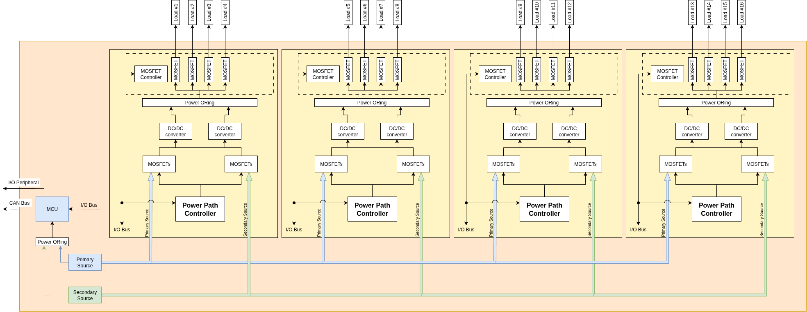
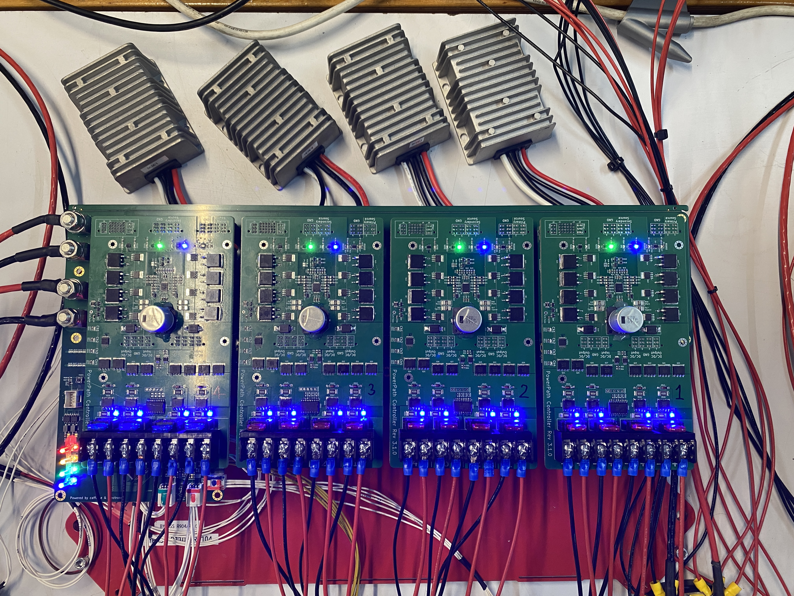
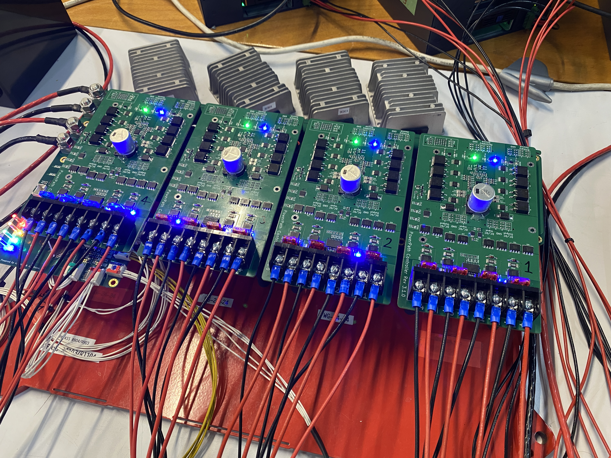

# Power Distribution Unit — Priority Path & Redundant Output ORing

**Status:** Built and deployed in production (Venti Technologies, autonomous vehicle fleet)

## Overview
At Venti Technologies, I designed the Power Distribution Unit (PDU) around a single hard
requirement: the system had to stay operational with no human intervention, including
through power events that would normally force a manual reset. That requirement broke
down into four concrete problems the PDU had to solve:

- **Ride through unexpected voltage drops** - stay functional during the vehicle's
  engine cranking event.
- **Survive refueling and battery swaps** - remain operational through the refueling or
  battery-swap process, which can last 15-30 minutes.
- **Enable sub-system power-cycling** - power-cycle individual subsystems independently,
  without a full system reset.
- **Protect inputs and outputs** - protect against over- and under-voltage on both
  primary and secondary power sources. All 16 output channels have independent current
  sensing and self-shutdown when current exceeds a configurable setpoint, alongside
  temperature sensors monitoring both internal and external PDU temperature.

The rest of this write-up walks through how each of these drove a specific design
decision.

## Architecture

The PDU distributes power from two independent sources — Primary and Secondary — across
four identical channel groups, each serving four output loads (16 channels total). Each
stage of the architecture maps directly to one of the requirements from the Overview.

### Design decisions

- **Priority Power Path Controller (input arbitration):** Arbitrates between Primary and
  Secondary sources per channel group, handing off between them without interrupting
  downstream power — this is what lets the system ride through engine cranking and
  survive refueling/battery-swap events. Reports source and fault status back to the MCU.

- **Power ORing (output redundancy):** Combines the outputs of two N+1 hot-redundant
  DC/DC converters after conversion. The converters were doubled specifically because of
  their comparatively low FIT rating relative to the rest of the design — with both
  alive they share the load, and either one can carry it alone if the other fails. Power
  ORing is what lets that failover happen without an interruption at the output.

- **Current-sensed MOSFET switched outputs:** Each of the 16 output channels is switched
  by its own MOSFET with independent current sensing and self-shutdown at a configurable
  setpoint. Because protection is per-channel rather than shared, a fault on one channel
  trips only that channel — this is also what enables independent sub-system
  power-cycling, with fault/ready status reported back to the MCU through the MOSFET
  Driver.

### Source arbitration — Power Path Controller

Each of the four channel groups has its own Power Path Controller, arbitrating between
Primary and Secondary source inputs and reporting status back to the MCU. This is what
allows the system to ride through engine cranking and survive refueling/battery-swap
events (up to 15–30 minutes) — if one source sags or drops out, the controller hands off
to the other without interrupting downstream power.

### Redundant switching and conversion

Each channel group's arbitrated source feeds a **redundant pair of MOSFET switches**
into **both** DC/DC converters. The DC/DC converters were doubled up specifically because
of their comparatively low FIT (Failures In Time) rating relative to the rest of the
design: with both converters alive, they load-share; if one fails, the other continues
carrying the full load on its own. The two converter outputs are then combined through
Power ORing before reaching the switched outputs — giving each channel group N+1
hot-redundant conversion, on top of the redundant switching ahead of it.

### Per-channel output protection and power-cycling

Each of the 16 output channels is switched by its own MOSFET, with current sensing and
self-shutdown implemented **per individual channel** rather than shared across the group.
This is what enables independent sub-system power-cycling — any single channel can be
switched or shut down without affecting the other 15 — and it's also the primary
over-current protection mechanism: a fault on one channel trips only that channel, with
fault/ready status fed back to the MCU through the MOSFET Driver.

### MCU power path — independent of the channel groups

The MCU has its own dedicated Power ORing stage, fed directly from Primary and Secondary
sources rather than through any channel group's conversion path. This means the control
plane — and its ability to report a fault — stays alive even if a channel group's DC/DC
or ORing stage fails downstream. The MCU also monitors the secondary battery relay,
a manual button input, temperature sensors, and charger-enable status.

### Thermal management

The PDU has two temperature sensors — one external, one internal — each serving a
different purpose.

The **external sensor** drives a heater pad with a hysteresis band: it turns on below
10°C and off above 25°C, keeping the unit within its operating temperature range in cold
conditions. This is a closed-loop, autonomous action — the PDU decides and acts on its
own.

The **internal sensor** reports PDU temperature over CAN as raw telemetry, with no
threshold or onboard action tied to it. The PDU doesn't decide what "too hot" means —
it just reports the number, leaving interpretation and any response to whatever system
is consuming the CAN message.

This reflects a deliberate split in the design: the heater is a closed local control
loop the PDU can fully own, while internal temperature is a system-level judgment call
that depends on context the PDU itself doesn't have — so it's exposed as data rather
than baked in as a threshold.

## Why this matters for spacecraft power systems

Current-limited, individually switchable, fault-isolatable outputs are the standard pattern
used across spacecraft power distribution — ESA's PDU designs use dedicated Latching Current
Limiter circuits per subsystem with individual current limits and undervoltage protection;
New Horizons' PDU uses fully redundant solid-state switching with hardware fault protection.
This PDU independently converges on the same functional pattern, built and validated in a
terrestrial safety-critical context.

## Specs

| Parameter | Value |
|---|---|
| Input sources | Primary (vehicle generator) + Secondary (LiFePO4 battery), redundant, arbitrated |
| Output channels | 16 (4 groups × 4 channels) |
| Per-channel protection | Independent current sensing + self-shutdown |
| Power conversion redundancy | N+1 hot-redundant (dual DC/DC per group, load-sharing) |
| External temp sensor (heater control) | On below 10°C, off above 25°C |
| Internal temp sensor | Reports raw temperature via CAN (telemetry only, no threshold) |
| Input voltage range | 21–36 V |
| Output voltage(s) | Regulated 24 V or 12 V, depending on DC/DC configuration per group |
| Per-channel current limit | 6 A nominal setpoint (8 A absolute maximum) per channel |
| Group current limit | 25 A max per group |
| Communication interface | CAN |

## Media

*Click to watch: PDU power source switching with load test at 90A.*

*Load test: PDU running at its designed rated capacity — supplying electronic load
testers and two PCs under full GPU load, one 12V output group and three 24V output
groups, each drawing ~26A. Input current measured at 90A. Output power remained
uninterrupted throughout a live switch between Primary and Secondary sources.*

Top view

ISO view