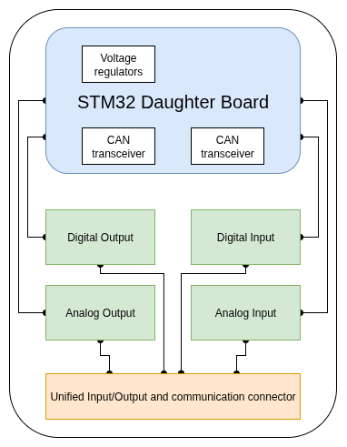
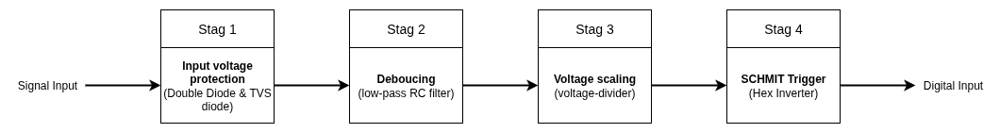
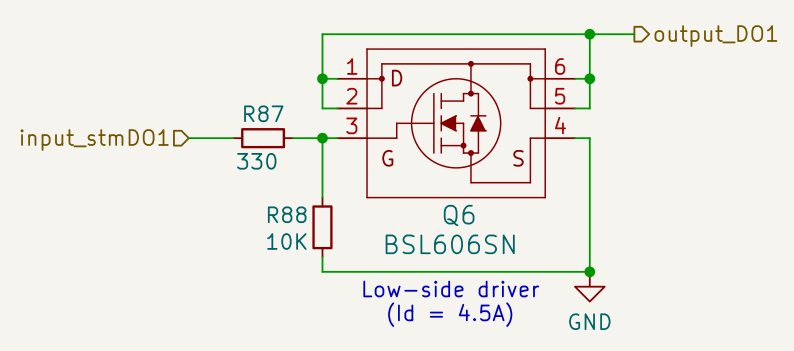
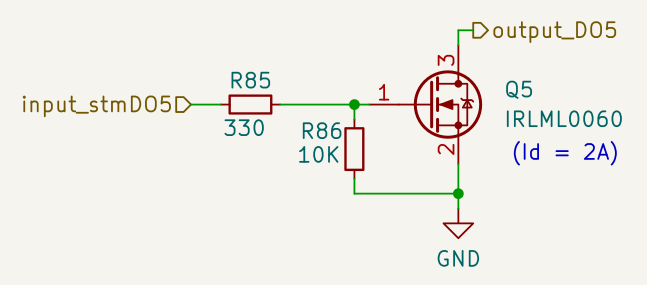
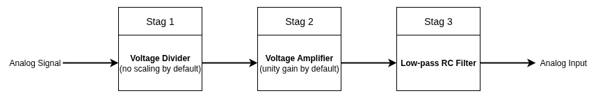
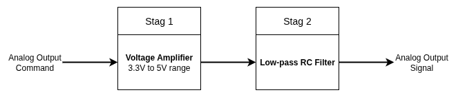
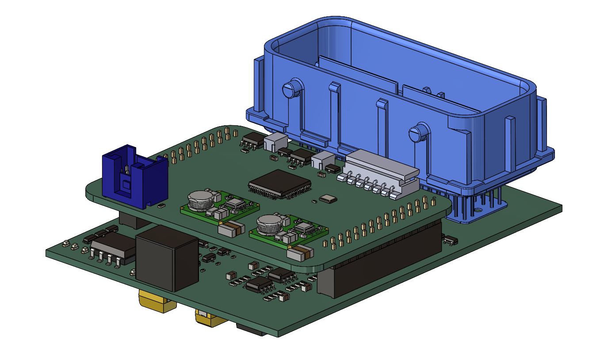
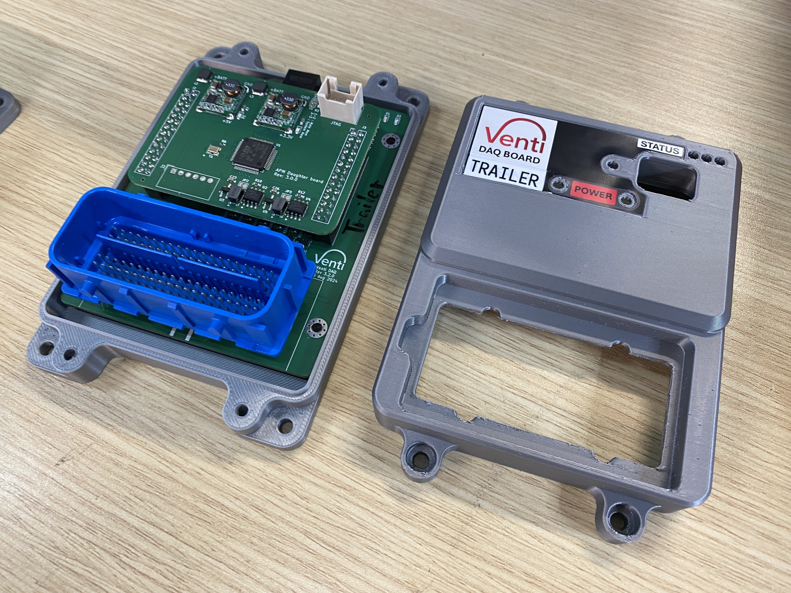

# General-Purpose I/O Module — CAN Bus Controlled

**Status:** Built and deployed — 3-4 units reused across multiple vehicle projects

## Overview

Internally called "Venti DAQ," this is a CAN-Bus General-Purpose I/O Module built to
control and monitor a wide variety of devices in and around the Prime Mover — designed
to be as generalized and reusable as possible rather than purpose-built for a single
project. It inherited a baseline requirement set from an earlier DAQ board used on the
PSA project: temperature sensor inputs, UPS battery voltage sensing, relay/contactor
coil control, door sensor inputs, and CAN communication.

The design generalizes that baseline into four core I/O functions — digital input,
digital output, analog input, analog output — plus utility functions (status LEDs,
buzzer, dual battery voltage sensing) and CAN communication. A 4-position DIP switch
assigns each unit a bus ID, allowing multiple I/O modules to share a single CAN bus.
This module has been built and deployed as 3-4 units across multiple vehicle projects.

The board also uses a **second, independent CAN interface** to bridge a connected Sonar
module — which runs at a different bus baudrate (125K) — onto the module's own main CAN
bus (250K), acting as a protocol/baud-rate translator alongside its primary I/O role.

## Architecture

### Digital Input

The module provides **12 digital input channels**, designed to accept the full battery
voltage range directly (approximately 0V–27V) rather than requiring pre-conditioned
logic-level signals. At design time, the exact deployment — what would be connected,
where, and how — wasn't yet known, so accepting raw battery-level signals directly kept
the module usable anywhere on the vehicle without external signal conditioning. Each
input passes through a four-stage protection and conditioning chain before reaching the
microcontroller:

1. **Clamping diode (BAV199LT1G)** — clamps the input between 0V and +Batt (~27V),
   protecting against sustained over/under-voltage. Rated for up to 70V reverse
   voltage, giving headroom above the expected battery range. This stage isn't fast
   enough to react to transient spikes on its own, which is what stage 2 is for.

2. **TVS diode (SMAJ28A)** — a unidirectional transient-voltage-suppression diode with
   a 28.0V standoff voltage and 31.1V breakdown voltage, reacting fast enough to absorb
   short high-voltage transients and ESD events that the clamping diode alone can't
   catch in time.

3. **RC debounce** — a resistor-capacitor stage tuned to a 13.6ms time constant, so any
   signal transition shorter than that is treated as noise rather than a real state
   change.

4. **Voltage divider + Schmitt trigger (MC74HC14ADR2G)** — steps the signal down to a
   0–5V range, then through a Schmitt trigger for additional hysteresis on rising and
   falling edges, further reducing bounce. A final divider brings the signal down to
   the STM32's 3.3V logic level.

Two of the 12 channels are wired for **door sensors**. The current sensors are 2-wire
(normally-open, pulled up by the debounce stage — contact closure pulls the line low),
but the design also supports 3-wire NPN/PNP sensor types by populating an additional
pull-up or pull-down resistor, without changing the board.

### Digital Output

The module provides **9 digital output channels** (4 high-current, 5 low-current),
driven by **low-side MOSFET drivers** rather than high-side drivers — a deliberate
choice: with a low-side driver, the module can switch any load voltage up to the
MOSFET's Vds rating, rather than being tied to a fixed supply rail. Two driver sizes
cover the expected load range:

- **High-current channels (BSL606SN, 4.5A)** — for larger loads like warning lights,
  horns, and light strips. AEC-Q101 automotive-grade, 60V Vds, 1.8V gate threshold.

  

- **Low-current channels (IRLML0060, 2A)** — for smaller loads like relay coils and
  LEDs. 60V Vds, 2.5V max gate threshold.

  

Both parts were chosen specifically because their gate threshold voltage is below 3.3V,
allowing the MOSFETs to be driven directly from an STM32 GPIO pin with no separate gate
driver stage. Several output channels are also wired to PWM-capable timer channels,
allowing dimming or soft-switching behavior where needed rather than simple on/off.

#### Scaling to higher-current loads

As the project progressed, demand grew for driving larger loads through the digital
outputs, which meant revisiting both PCB trace width and MOSFET selection rather than
assuming the original parts would scale.

**Trace width** was calculated using a standard trace-width calculator, targeting a
20°C temperature rise. At 10A on 1oz copper, the external-layer trace width came out to
186 mil — too wide for the available board space. Moving to 2oz copper on external
layers roughly halved the required width, at the cost of a more expensive fabrication
run — a real tradeoff between board cost and layout density, not just a spec to look up.

**MOSFET selection** turned out to be less straightforward than reading the headline
current rating. Using the IRLR3636TRPBF as an example: its datasheet lists a 50A
package-limited drain current, which looks sufficient at a glance. But that rating
applies at a much higher gate-source voltage than the 3.3V the STM32 can supply.
Cross-referencing the datasheet's Id-vs-Vds curves at Vgs = 3.3V shows the *effective*
usable current is closer to **30A** — a 40% gap between the number on the front page
and what the part can actually deliver in this circuit. Confirming this before
committing to a part avoided a design that looked adequate on paper but wasn't in
practice.

### Analog Input

The module provides **6 general-purpose analog input channels**, plus 2 dedicated
channels for board and external (UPS) battery voltage sensing — separate from the
general-purpose inputs since they serve a fixed monitoring role rather than an
open-ended one.

Analog inputs are designed for a **0–5V signal range**. Each channel passes through a
signal chain built for the same "don't know the exact use case yet" generality as the
digital inputs:

1. **Optional input voltage divider** — two resistor pads in parallel, left unpopulated
   by default. If a future signal needs scaling down before the op-amp stage, the
   divider can be populated without a board revision; using two parallel resistors
   instead of one gives more flexibility in hitting a precise ratio with resistor
   values that actually exist in standard series.

2. **Op-amp buffer (LM2904, unity gain)** — buffers the signal and presents a
   high-impedance input, so connecting a sensor doesn't load down or distort the
   measurement. An optional gain-setting resistor pad is left unpopulated by default,
   allowing the same circuit to be reconfigured for gain beyond unity if a future
   sensor needs amplification instead of buffering.

3. **Low-pass filter** — tuned to a 10ms time constant, sufficient to remove
   high-frequency noise without materially slowing down the signal.

4. **Output voltage divider** — steps the signal down from 0–5V to the STM32 ADC's
   0–3.3V input range.

The op-amp supply itself is a design constraint worth noting explicitly: an op-amp's
output range is bounded by its supply voltage, so the LM2904 (rated 3V–36V supply) was
chosen with enough headroom for the board's voltage rails, with the LM2904B/BA as a
drop-in alternative if a wider supply range is ever needed.

**Primary use case:** three analog inputs are allocated for temperature sensing, using
purpose-built analog-output temperature sensors (TMP35/TMP36/TMP37) rather than
thermistor-based sensing. Thermistors were considered and rejected for this design —
their resistance-based output is harder to calibrate accurately and has significant
non-linearity across the measurement range. The TMP35/36/37 family outputs a voltage
that scales linearly with temperature, trading some sensitivity for simplicity and
calibration-free accuracy, and its TO-92 package allows it to be mounted off-board on a
cable rather than requiring on-board placement.

The specific part varies by deployment climate: **TMP37** (highest sensitivity, 20mV/°C)
is used on modules operating in Singapore/Asia, while **TMP36** is used on modules
deployed in the US, where the sensor's operating temperature spec better matches the
colder climate range. Both are pin-compatible, so swapping between them requires no
board changes — only a part substitution and a firmware scaling-factor update.

### Analog Output

The module provides **2 analog output channels**, built around the STM32's onboard
12-bit DAC. At design time, there was no specific requirement driving this function —
so unlike the input side, which was shaped by known use cases (temperature sensing,
door sensors), the analog output implementation was kept deliberately standard rather
than over-engineered for a use case that didn't exist yet.

The DAC itself outputs 0–3.3V, but the target output range is 0–5V, so each channel
uses an **op-amp (LM2904) configured for a fixed gain of 1.5165** to scale the signal
up to the full 0–5V range. The output then passes through the same **10ms low-pass
filter** time constant used on the analog inputs, smoothing the signal and reducing
the effect of long cable runs — a real consideration on a vehicle where an analog
output might drive a device some distance away from the board.

This function has been tested and verified working, but hasn't yet had a deployed use
case in the field.

### Utility Functions & CAN Bridging

Beyond the four core I/O types, the module includes a set of supporting utility
functions: three status LEDs (red/yellow/green), a bi-directional red/green LED, a
buzzer, dual battery voltage sensing (board input and external UPS battery), and
broken-out UART and SPI ports for future expansion. A 4-position DIP switch assigns
each unit a bus address, which is what allows multiple I/O modules to coexist and be
individually addressed on the same CAN bus.

The most functionally distinct utility feature is the module's **second CAN
interface**, which isn't used for the module's own command/feedback traffic at all.
Instead, it acts as a **CAN bus bridge**, translating messages from a connected Sonar
module — which communicates at a different baud rate (125K) — onto the module's main
CAN bus (250K). This means the module does double duty: it's both a general-purpose I/O
node on the main bus, and a protocol/baud-rate gateway for a sensor that couldn't
otherwise communicate on that bus directly.

The 4-position DIP switch address scheme also enabled downstream firmware tooling: a
colleague built a CAN-based firmware update process using the per-unit addressing,
allowing an individual board to be flashed with new firmware over the shared CAN bus
without needing physical access to each unit. That capability was built on top of the
addressing design described here, not part of this write-up's own scope.

## Why this matters for spacecraft avionics

Distributed remote I/O over a shared bus — rather than home-running every sensor and
actuator to a central computer — is a common pattern in modern spacecraft avionics,
used to reduce wiring harness mass and complexity by placing I/O close to the hardware
it serves. Small satellite platforms in particular often use CAN bus specifically for
this role, given its multi-drop wiring, built-in arbitration, and fault tolerance.
This module's core structure — a general-purpose I/O node with per-unit bus addressing,
allowing multiple identical units to share one bus — follows that same pattern.

Two design choices carry over directly:

- **Per-node addressing for multi-unit deployment.** The DIP-switch addressing scheme
  that lets several I/O modules coexist on one CAN bus is the same underlying concept
  as remote terminal addressing on a shared spacecraft data bus — assigning each node
  an identity so a central controller can address it individually over shared wiring.
- **Protocol bridging between subsystems running different bus parameters.** The
  Sonar-to-main-bus baud rate translation is a small-scale example of a gateway
  function — translating between subsystems that don't natively speak the same bus
  configuration — which shows up in spacecraft avionics whenever different subsystems
  or heritage hardware need to interoperate on a shared data architecture.

The input-protection discipline (clamping, transient suppression, debouncing before a
signal ever reaches the microcontroller) also reflects the same "assume a harsh,
unpredictable electrical environment" design posture that spacecraft I/O interfaces are
built around, even though the specific threats differ — automotive transients and ESD
here, versus radiation-induced upsets and connector/cabling faults in a space
environment.

This module wasn't designed for space, and no claim is made that it meets space-grade
requirements (radiation tolerance, vacuum operation, or flight qualification). What it
demonstrates is the same class of architectural reasoning — generalized, reusable,
addressable I/O nodes on a shared bus, hardened against a harsh electrical environment —
applied in a terrestrial, safety-critical context.

## Specs

| Parameter | Value |
|---|---|
| Microcontroller | STM32F446, LQFP64 package |
| Digital inputs | 12 channels, 0–27V range (battery-level tolerant) |
| Digital outputs | 9 channels — 4 high-current (4.5A, BSL606SN), 5 low-current (2A, IRLML0060) |
| Analog inputs | 6 general-purpose + 2 dedicated (board + external UPS battery voltage), 0–5V range |
| Analog outputs | 2 channels, 0–5V range (DAC + op-amp gain stage) |
| Input protection (digital in) | Clamping diode + TVS diode + RC debounce (13.6ms) + Schmitt trigger |
| Communication | Dual CAN — main bus (I/O command/feedback, 250K) + bridge bus (Sonar module translation, 125K) |
| Device addressing | 4-position DIP switch, per-unit bus ID (supports multiple units on one CAN bus) |
| Expansion | UART port, SPI port (chip-select pin) |
| Utility | 3x status LED (R/Y/G), 1x bi-directional LED (R/G), buzzer |
| Deployment | 3–4 units built and reused across multiple vehicle projects |

## Media

3D Model of General-Purpose I/O Module

General-Purpose I/O Module with casing