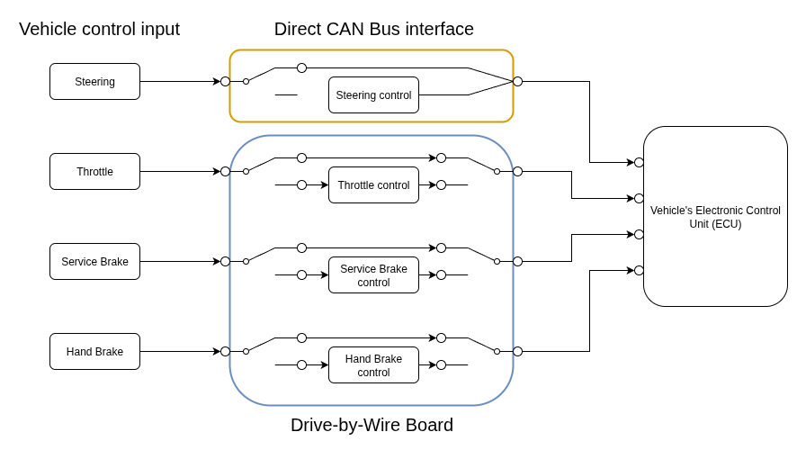
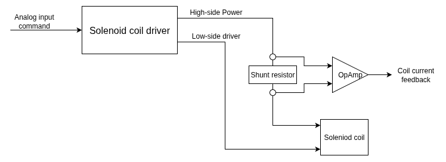
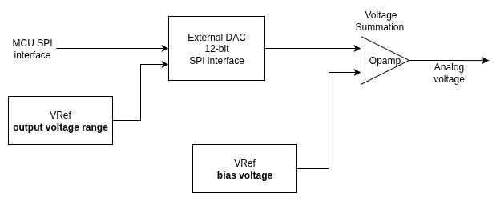
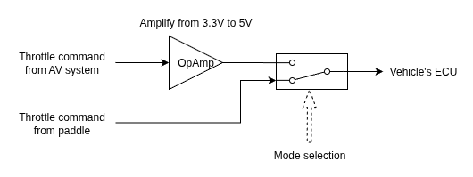
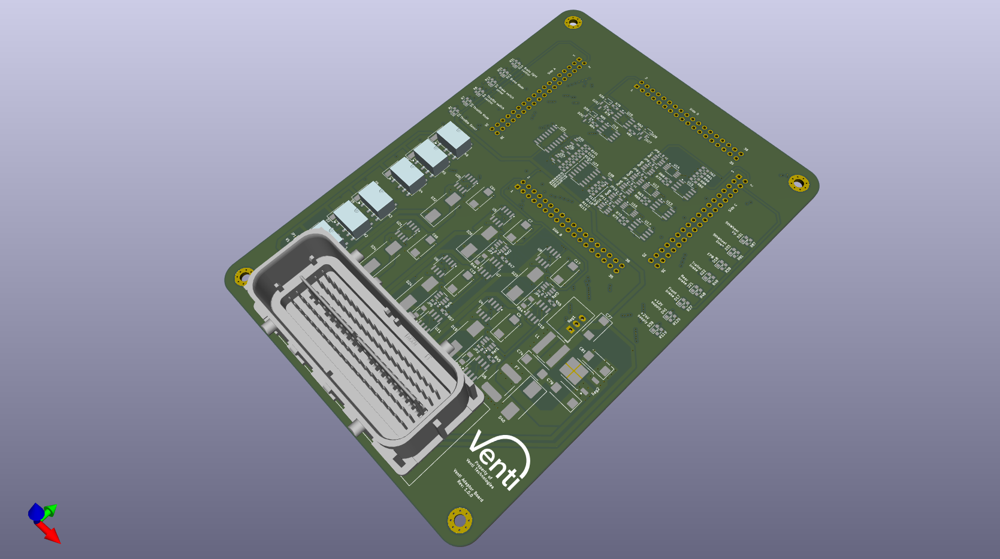
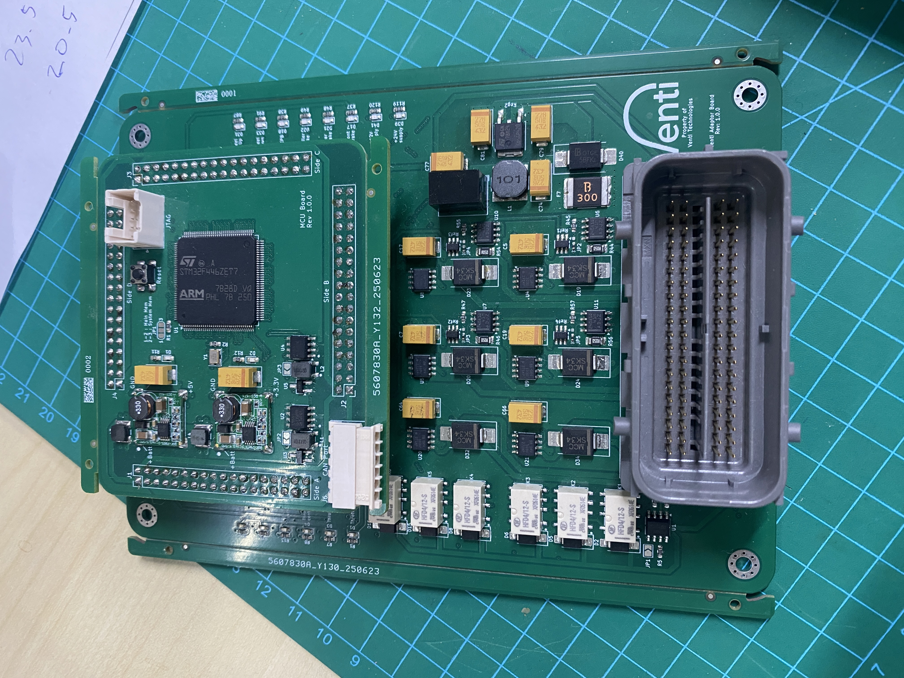

# Drive-by-Wire Auto/Manual Control Authority Switch

**Status:** Built and deployed in production — core safety system across multiple autonomous vehicle programs

## Overview

Most vehicles on the market aren't drive-by-wire ready out of the box, and generally
don't expose their control hardware for external interfacing. To make autonomous
operation possible, I developed a circuit that takes control of a vehicle's basic drive
functions — steering, throttle, service brake, and hand brake — while preserving the
ability to hand control back to a human driver.

This circuit is the core safety system of the autonomous vehicle stack: without it,
there's no way to arbitrate between autonomous and manual control, and no safe way to
fail back to a human if the autonomy system needs to hand off. Drive-by-wire
integration is highly dependent on the specific vehicle brand and model — this is one
of several such circuits I've developed across different vehicle platforms.

## Architecture

The circuit sits between the vehicle's native control inputs (steering, throttle,
service brake, hand brake) and the vehicle's Electronic Control Unit (ECU), arbitrating
which source — the human driver or the autonomy system — is actually in command at any
given moment. Two different arbitration mechanisms are used, depending on how each
control input is implemented on the underlying vehicle:

- **Throttle, Service Brake, and Hand Brake** use a **relay-based switching
  architecture**. Each channel has two relays: one ahead of that channel's control
  circuit, selecting between a direct manual passthrough and a path through the
  autonomy-controlled circuit, and a second relay after it, merging back to a single
  signal into the ECU. In manual mode, the relays default to the passthrough position —
  the driver's input goes straight to the ECU with no autonomy hardware in the path at
  all. Only when autonomous mode is actively commanded do the relays switch the signal
  path through the control circuits described below.

- **Steering** is arbitrated differently, because the vehicle's steering system already
  accepts commands over CAN bus natively. Rather than switching between two physical
  signal paths, arbitration happens at the message level — the autonomy system either
  is or isn't permitted to issue steering commands over CAN, using the same bus the
  vehicle's own steering system already listens to.

### Emergency manual takeover

While in autonomous mode, the circuit continuously monitors the vehicle's brake light
sensor. If a safety driver needs to take over immediately, no special switch or
procedure is required — tapping the brake pedal enough to trigger the brake light is
read as an override signal, and the system reverts to manual mode immediately. This
was a deliberate design choice: under an emergency, a safety driver shouldn't need to
locate a specific control or remember a non-obvious procedure — tapping the brake is
already an instinctive action, so it doubles as the takeover trigger without adding any
new behavior for a human to learn.

### Brake Control — Front, Rear, and Trailer (Independent Closed Loops)

Front, rear, and trailer brakes are each controlled by their own independent closed-loop
circuit rather than a single shared controller. This is necessary because the relay
valves used at each brake point have different characteristics — treating them
identically would produce uneven braking force across the vehicle, so each loop is
tuned and controlled separately to keep braking force equivalent across all three.

A typical brake control circuit consists of just a solenoid driver chip actuating the
relay valve, with feedback coming solely from a pressure sensor reading downstream of
the valve. This design goes a step further by adding a **second feedback path**:
current sensing on the solenoid coil that actuates the relay valve, alongside the
pressure sensor feedback. Pressure feedback shows the hydraulic *result* of a valve
command, but it can't show what the valve itself is actually doing — coil current
sensing reveals that directly, since the current signature reflects the solenoid's real
electromechanical response, not just the downstream effect. Combining both feedback
paths gives the control loop information neither sensor alone can provide, and improves
control performance beyond what a pressure-only feedback loop can achieve.

**Circuit implementation:**

- **DRV103U solenoid driver** — PWM duty-cycle controlled from the MCU, driving the
  solenoid that actuates the relay valve, with a dedicated enable line and a fault
  status flag driving an onboard LED indicator.
- **Bidirectional current sensing (INA240A1, 20V/V gain)** — measures current through
  the solenoid coil across a 50mΩ sense resistor. Because solenoid current can flow in
  either direction, the amplifier output is biased around a 1.6V reference (generated
  by a precision REF35160 reference IC) rather than referenced to ground, so both
  current directions are distinguishable rather than clipped. Output is conditioned to
  a 0.1V–3.1V range before being read by the MCU's ADC.
- **Protection:** a fuse (3A hold / 6A trip) protects the supply line into the driver
  circuit, and a Schottky flyback diode across the solenoid coil protects against
  inductive kickback when the valve switches off.

### Brake Control — External 12-bit DAC

The STM32 only provides two internal DAC outputs, and one was already committed to
Throttle — leaving only one internal channel for three independent brake circuits
(front, rear, trailer). Rather than compromise on the number of independently
controlled brake channels, each brake circuit uses its own **external 12-bit DAC**
instead of sharing or multiplexing the single remaining internal DAC output.

This constraint turned into an incidental benefit: the external DAC's output range and
DC offset are both configurable, and in the current design are set to a 0–2.048V range
with a 1.024V offset — producing an output window of 1.024V–3.072V across the full
12-bit resolution. That gives finer control resolution within the driver circuit's
actual usable voltage window than the STM32's fixed-range internal DAC could have
provided, even though channel availability — not precision — was the reason the
external DAC was chosen in the first place.

### Hand Brake — Same Circuit, Different Control Semantics

Hand brake uses the same driver and dual-feedback circuit as Service Brake, but the
valve itself is different: hand brake is controlled by a simple on/off solenoid valve,
rather than the variable-pressure relay valve used for service braking. Because of
that, hand brake control isn't a continuous closed-loop pressure control problem —
it's a binary on/off command.

In this context, current sensing serves a different purpose than it does for service
braking: rather than shaping a continuous control response, it **confirms actual valve
state**. A PWM/enable command tells the valve to engage, but without current feedback,
the system has no way to distinguish "commanded engaged" from "actually engaged" — and
that distinction matters: if the system believes the hand brake is applied when it
isn't, the vehicle could roll unexpectedly while the control system assumes it's
secured. Current sensing closes that gap by confirming the solenoid actually drew the
expected current signature for an engaged state, rather than trusting the command was
successfully carried out.

### Throttle — Direct DAC + Amplification

Throttle control is comparatively simple relative to the brake circuits: an STM32
internal DAC output (0–3.3V) is scaled up through an op-amp stage to the vehicle's
full 0–5V throttle range. The STM32 maintains a calibration mapping between DAC output
voltage and the vehicle's own CAN-reported throttle position (%), so a commanded DAC
voltage translates predictably to a known, verifiable throttle percentage rather than
an assumed one.

The closed-loop speed control itself doesn't live on this board — that logic runs on a
separate onboard PC, which issues throttle commands based on the vehicle's actual speed
response. This board's role is narrower and more contained: execute a commanded
throttle position accurately and verifiably, not decide what that position should be.
Throttle doesn't carry the same safety criticality or precision requirement as braking,
so this simpler circuit — DAC-driven, CAN-verified, externally controlled — is a
deliberate match to the actual requirement rather than a shortcut.

## Why this matters for crewed spacecraft systems

Crewed spacecraft — Orion, Dragon, Starliner — all require the same core capability: switching
control authority between autonomous/computer control and manual crew control, with a hard
guarantee the switch is safe and unambiguous. This is the same control-authority arbitration
problem, solved for a production automotive safety-critical system.

## Specs

| Parameter | Value |
|---|---|
| Controlled channels | Steering, Throttle, Service Brake (front/rear/trailer), Hand Brake |
| Steering arbitration | CAN bus message-level arbitration (native vehicle CAN steering interface) |
| Throttle/Brake arbitration | Dual relay per channel — manual passthrough vs. autonomy-controlled path |
| Emergency manual takeover | Brake light sensor monitored during autonomous mode; brake tap reverts to manual instantly |
| Brake feedback | Dual closed-loop — downstream pressure sensor + solenoid coil current sensing (INA240A1, 20V/V gain) |
| Brake control resolution | External 12-bit DAC per channel, 1.024V–3.072V output window |
| Throttle control | STM32 internal DAC (0–3.3V) + op-amp to 0–5V, CAN-verified position mapping |
| Hand brake logic | Binary on/off, current-sensing confirms actual engagement state |
| Brake driver protection | 3A hold / 6A trip fuse; Schottky flyback diode per solenoid |

## Media

Drive-by-Wire board without MCU board

<!-- 
Drive-by-Wire board with MCU board -->
