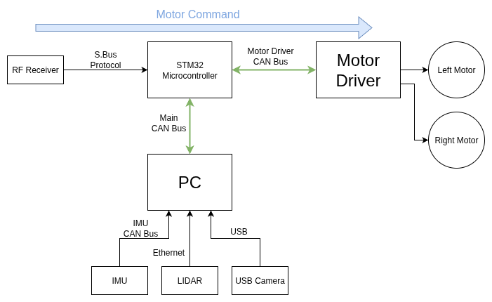
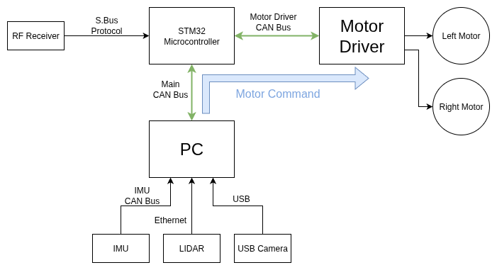
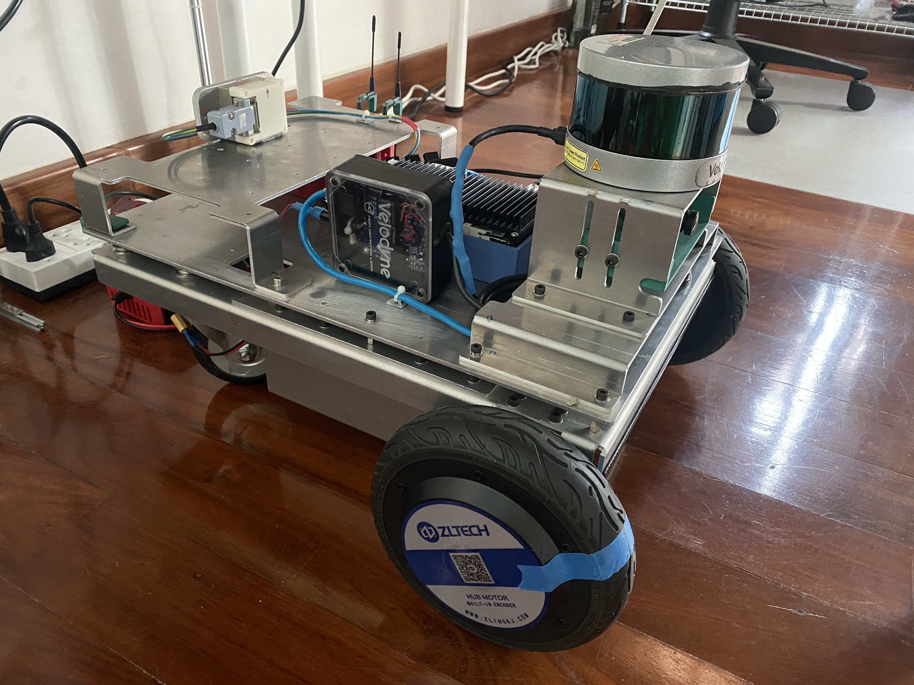

# Differential-Drive SLAM Robot — ROS2, IMU/LiDAR/Camera Fusion

**Status:** Personal project, built and operational

## Overview

Unlike the other projects in this repo, which came out of production requirements at
Venti Technologies, this is a personal project — built to get hands-on robotics
experience outside of automotive autonomous vehicle work. It covers ground I hadn't
worked directly before: mechanical CAD design in Fusion 360 (aluminum bending design,
component placement), and setting up a full ROS2 navigation stack with sensor fusion
from IMU, wheel encoders, and a 16-beam LiDAR for SLAM and mapping. A separate camera
is mounted for monitoring/FPV, but isn't part of the SLAM sensor fusion.

Control authority has **three modes** — Manual, Hold, and Auto — selected via an
RC-plane radio joystick using the SBUS protocol for low-latency control. Hold is a
deliberate middle state between Manual and Auto: throttle at 0% and brake at 50%, while
SLAM's position and speed estimation keep running uninterrupted. Without Hold, pausing
the robot would require dropping to Manual mode and relocalizing from scratch before
returning to Auto — Hold avoids that cost entirely, letting the robot pause and resume
autonomous operation without losing its position estimate.

## Architecture

Flow of Motor command in Manual and Hold mode

Flow of Motor command in Auto mode

The system is built around three independent CAN buses, all managed through the STM32
microcontroller, which acts as the single point of control-authority arbitration
between manual and autonomous command sources — the same underlying principle as the
Drive-by-Wire project's relay-based arbitration, just implemented at the message level
instead of with physical relays.

- **Main CAN bus** — STM32 ↔ PC, carrying navigation commands and mode state
- **Motor Driver CAN bus** — STM32 ↔ Motor Driver, carrying the final arbitrated motor
  command
- **IMU CAN bus** — a separate, dedicated CAN bus connecting the IMU directly to the
  PC, on the PC's second independent CAN port

LIDAR connects to the PC over Ethernet, and the monitoring/FPV camera connects via USB.

### Manual mode

The RF receiver sends stick input to the STM32 over SBUS. The STM32 decodes it
directly and translates it into a motor driver command, sent out over the Motor
Driver CAN bus. The PC is not in this command path at all in Manual mode.

### Auto mode

The RF receiver still sends the selected mode to the STM32 over SBUS, and the STM32
forwards that mode state to the PC over the Main CAN bus. The PC's Navigation node
computes a motor command and sends it back to the STM32 over the Main CAN bus. Critically,
**the STM32 only forwards navigation commands to the Motor Driver when the current mode
is Auto** — the PC can compute and send whatever it wants, but the STM32 is the
authority that decides whether that command actually reaches the motors. This mirrors
the arbitration philosophy in the Drive-by-Wire project: the safety-critical decision
lives in one deterministic place, rather than being trusted to the source of the
command itself.

### Hold mode

In Hold, the STM32 forces the motor command to a fixed state — 0% throttle, 50%
brake — regardless of what the Nav node on the PC is doing. Critically, the Nav node
keeps running normally in the background: SLAM position and speed estimation continue
updating, and the Nav node continues computing and sending motor commands over the
Main CAN bus exactly as it would in Auto mode.

The difference is that the STM32 never forwards those commands to the Motor Driver
while in Hold — they're computed and observable, but harmless. This makes Hold a
built-in dry-run verification step: a newly started or freshly modified Nav node can
be checked against sane output before ever being trusted with the motors, rather than
switching straight to Auto and finding out the hard way that a bug sends the robot into
a wall at full speed the moment it activates.

### SLAM & Sensor Fusion

Localization and mapping run entirely on the onboard PC, using a standard but properly
integrated ROS2 stack:

- **Odometry fusion (robot_localization, EKF)** — wheel encoder odometry and IMU data
  are fused through an Extended Kalman Filter, producing a more accurate and drift-
  resistant odometry estimate than either sensor alone. Wheel encoders drift over
  distance (wheel slip, uneven terrain), while IMU alone drifts over time (integration
  error) — fusing both compensates for each sensor's individual weakness.
- **SLAM (slam_toolbox)** — the 16-beam LiDAR feeds slam_toolbox, which builds a map of
  the environment while simultaneously localizing the robot within it, using the fused
  EKF odometry as its motion prior.
- **Navigation (Nav2)** — ROS2's standard navigation stack consumes SLAM's position
  estimate and map to handle path planning, costmaps, and obstacle avoidance, computing
  the motor commands sent to the STM32 over the Main CAN bus — subject to the STM32's
  mode-based arbitration described earlier.
- **Camera** — mounted separately for monitoring/FPV only; not part of the sensor
  fusion, SLAM, or navigation pipeline.

## Why this matters for space robotics

IMU/LiDAR/camera sensor fusion and SLAM are the terrestrial analog of proximity-operations and
relative-navigation problems in space robotics — approach and characterization of a target for
docking or capture, or rover terrain-relative navigation. This project is the most direct,
though smallest-scale, connection in this portfolio to that class of problem.

## Specs

| Parameter | Value |
|---|---|
| Platform | Differential-drive, custom bent-aluminum-sheet chassis |
| Compute | Small form-factor x86 PC, Ubuntu |
| LiDAR | 16-beam, Velodyne/Ouster-class |
| IMU | CAN bus interface, fused via EKF |
| Wheel encoders | Fused with IMU via EKF (robot_localization) |
| Camera | USB, monitoring/FPV only (not part of SLAM) |
| SLAM | slam_toolbox |
| Navigation | Nav2 (path planning, costmaps, obstacle avoidance) |
| Control modes | Manual / Hold / Auto, selected via SBUS (RC-plane radio) |
| Microcontroller | STM32 — control-authority arbitration, motor driver interface |
| Communication | 3x independent CAN buses (Main, Motor Driver, IMU) |

## Media

<!-- CAD design work — component placement and aluminum sheet-metal chassis design in
Fusion 360. -->

"PooDin" the robot. Most of the electronics eg. batteries (24V),STM32 Board and cable harness are tucked inside of the robot so it cannot be seen from outside. This is "PooDin" in ready-to-run state.

Clip compare between pure Odometry (pure wheel encoder) in **Yellow** and sensors-fusion output in **Red**. You can see what is actually happening from USB camera view at the bottom left.